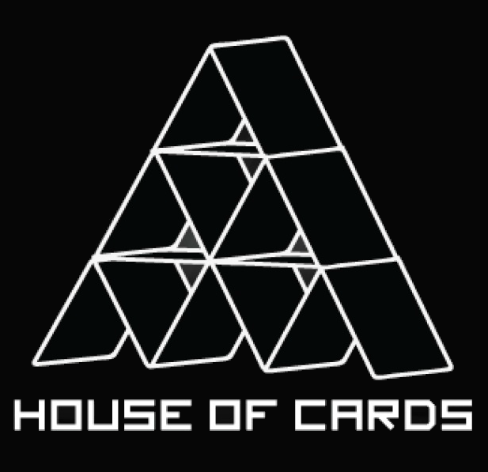

# House of cards

House of cards is an educational application suite providing a common competition platform for arbitrary card games.
Participants can create bots in their favourite programming language and compete with others in **real time** through
HTTP.

Running games where your bot is battling can be viewed live in a browser which makes cheering more thrilling.

This [documentation](https://zuehlke.github.io/HouseOfCards/) contains progress and important technical details.

  
   
  source: http://www.animecon.nl/images/House%20of%20Cards/House_of_cards.jpg

