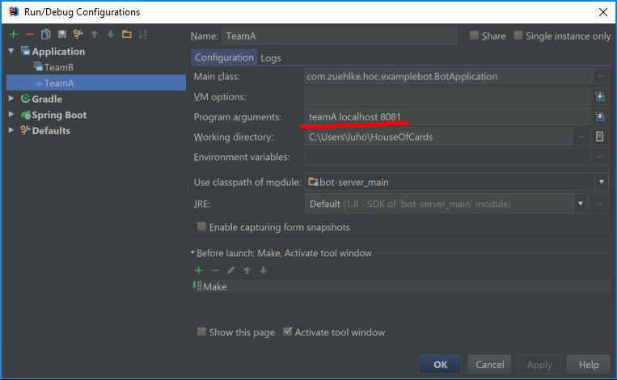

# Testdrive the competition runner
In order to smoke test the game-engine (competition runner) we provide two bots that will register for a game and act on
messages received from the game-engine. This is a step by step description to run the test.

Start the game-engine with the following commands:
1. Change to the directory. HouseOfCards/game-engine/game-server

2. run the command: <code>gradle run</code>. This will start the game-engine listening on TCP port 8080 on your local host.

3. Select the Intellij IDEA module "bot/bot-server".
4. Open the Run menu and select "Run...".
5. Select "Edit configuration in the pop-up window. Main class has to be "BotApplication".
6. In the field "Program arguments" enter the following arguments: teamA localhost 8081. (see screenshot)
7. Click "Run". This will start a bot that will that registers itself at the game-engine and listens on the TCP http://localhost:8081
8. Repeat steps 4-7 to start a second bot that listens on port 8082 by providing the corresponding argument.

As soon as the game-engine receives two registrations it will  start the game.
Upon receiving the YourTurn messages both bots will send a SetMessage with the smallest possible bet.

In order to start the bots with a defined list of predefined moves, pass the string "tobi" or "riki" as fourth argument (E.g. teamA localhost 8081 tobi). It is important to start the bot with the strategy "tobi" before a bot with stragegy "riki" is started. Otherwise the game will not be finished an the pots run out of scripted moves.

